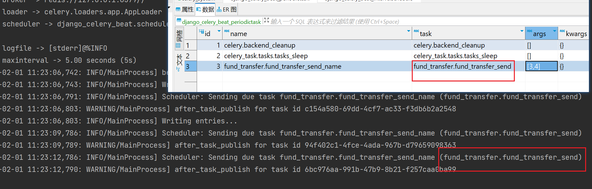
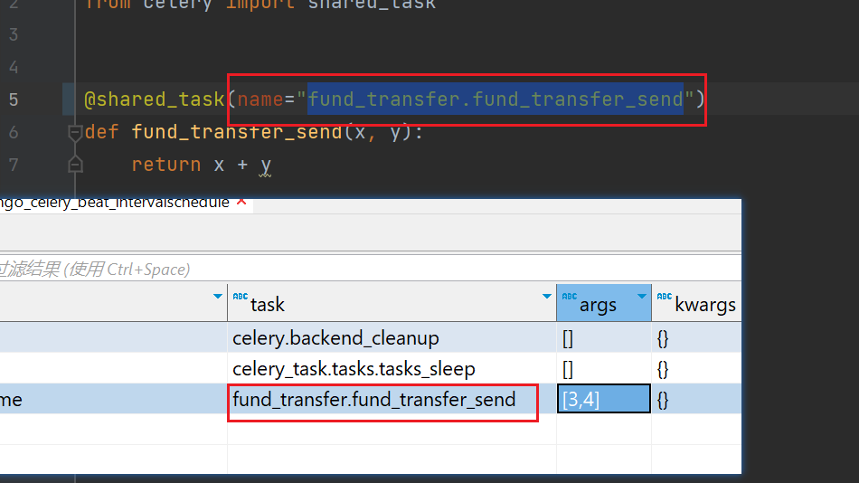
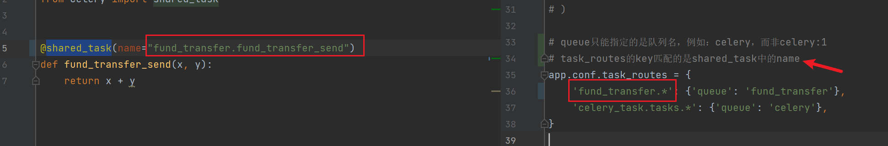
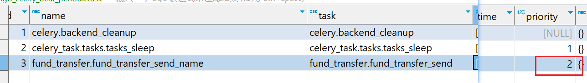
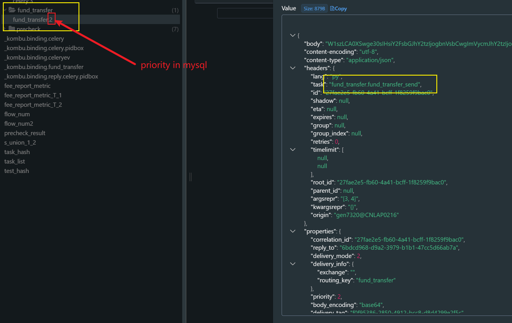

# Celery System


### Run command
    
- #### Celery Worker
    - window: 
    ```shell
      celery -A celery_task worker -l INFO -P eventlet
      celery -A celery_task worker -l INFO -P eventlet -Q fund_transfer -c 1
    ```
    - linux: 
    ```shell
      celery -A celery_task worker -l INFO
    ```

- #### Celery Client Send Task

  ```shell
  python manage.py shell
    
  from celery_task.tasks import tasks_sleep
  tasks_sleep.delay()
  
  from celery_task.fund_transfer.tasks import fund_transfer_send
  fund_transfer_send.delay(1, 4)
  ```

- #### Period Task Saved in Backend
  ```shell
  celery -A celery_task beat -l INFO --scheduler django_celery_beat.schedulers:DatabaseScheduler
  ```

### How to route the tasks / How workers locate the code:

  - celery beat会根据 mysql中的task字段进行调度；
    
  - 为了让worker能够找到对应的代码，task字段应该与shared_task的name参数对应
    


### How to send tasks to specific queue
  - `fund_transfer.`开头的任务都会被发送到 `fund_transfer` queue
  


### How to prioritize the tasks
  - 设置任务表的`priority`字段



### Version
- python=3.8.10
- Django==3.2.15
- djongo==1.3.6
- celery==5.2.7
- django-celery-beat==2.3.0
- pymongo==3.12.0
- Faker==19.3.0

- MongoDB Version: 4.4.12